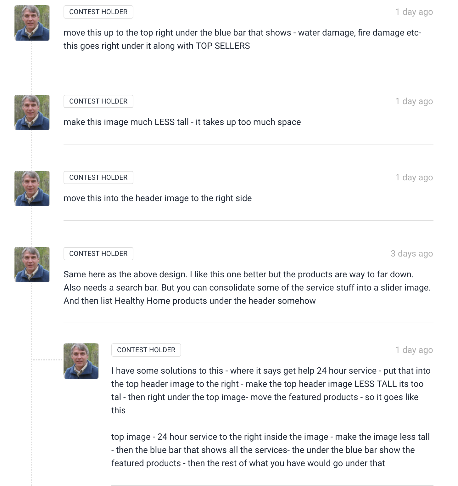
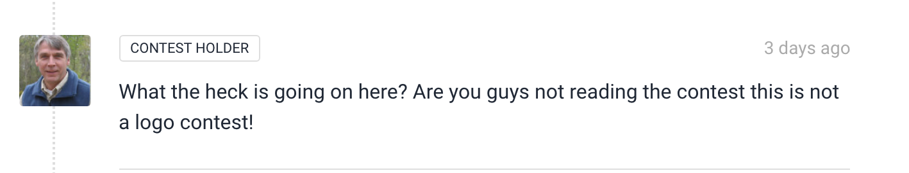
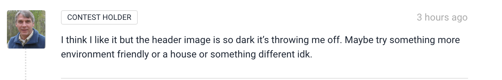
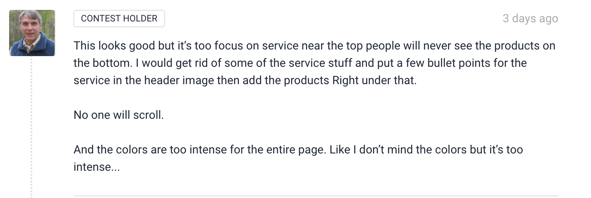

_Design Freelance_

#### _A full fledged website design! 2/22/19_

#### By _**Nathan Nielson, Isaac Hall, Philip Eskins, Ian Cook Westgate**_

## Description

_This application provides the user with the opportunity to peer into a cohesive design process_

## _User Personas_
_**Ben - Mold remediation expert:**_
 
_**Needs:**_
_Website should be concise and short, very little scrolling, products should be immediately visible. "basically it will be a one stop shop for mold removal and then also sell healthy supplies for example
Air filters / Healthy Paint / Healthy Household Cleaners etc..."_

_**Pain points:**_
_Large and dark images, too much scrolling, unnatural color schemes_

<!-- _**How can we serve? :**_ -->

## _User Stories_
_**Ben - MC client:**_
_As a client, I have a strong vision of want I want to represent my new company: I need a earthy, yet concise webpage with minimal scrolling that immediately communicates to my customers what I provide._

## _**Creative Planning**_
_**What do we want to convey:**_
* _Down to business_
* _Knowledgable_
* _"Clean and healthy"_
* _Simple Layout_

_**How shall we convey this:**_
* _"Clean" high quality images that don't take up TOO much room._
* _Concise and well placed text._
* _Little or no "clutter"_

_**User story insights:**_
_Client lacks experience with web development tools, has strong vision for what he wants but doesn't understand what he needs (from a web development perspective)_

_**Outside sources :**_
https://www.greenbuildingsupply.com/
https://www.iqair.com/
https://www.servpro.com/

 

 
 
 
 
 

 
 
 

 
 
 

## Description

_This application is a multi-page website meant for a "workspace" company.
It is meant to convey relevant information about the company in a concise
and aesthetically pleasing manner._

## Specs
* _Spec:_
* _Spec:_
* _Spec:_
* _Spec:_

## Setup/Installation Requirements
* _Use your command terminal (gitbash if you're using a windows machine) to clone the latest commit from Github, using the url provided_
* _Once the download is complete, 'cd' into the folder_
* _Once inside, run 'npm install' in your terminal to install nescessary plugins_
* _When the install is complete, run 'npm start' in your terminal to open the site in your browser!_
* _To view the code, press 'CTRL + C' to stop the auto update, run "atom ." in your terminal then navigate to the 'src' folder and open whatever you wish to view!_

## Known Bugs

_There are currently no known bugs_

## Support and contact details
_If you encounter any bugs or issues not documented during your experience, please feel free to contact me at my email: nathans-email@email.com_

## Technologies used

_This application was created using HTML, CSS, Bootstrap, Javascript and Jquery_

### License

Copyright (c) 2019 **_Nathan Nielson, Isaac Hall, Philip Eskins, Ian Cook Westgate, Epicodus_**

Permission is hereby granted, free of charge, to any person obtaining a copy
of this software and associated documentation files (the "Software"), to deal
in the Software without restriction, including without limitation the rights
to use, copy, modify, merge, publish, distribute, sublicense, and/or sell
copies of the Software, and to permit persons to whom the Software is
furnished to do so, subject to the following conditions:

The above copyright notice and this permission notice shall be included in all
copies or substantial portions of the Software.

THE SOFTWARE IS PROVIDED "AS IS", WITHOUT WARRANTY OF ANY KIND, EXPRESS OR
IMPLIED, INCLUDING BUT NOT LIMITED TO THE WARRANTIES OF MERCHANTABILITY,
FITNESS FOR A PARTICULAR PURPOSE AND NONINFRINGEMENT. IN NO EVENT SHALL THE
AUTHORS OR COPYRIGHT HOLDERS BE LIABLE FOR ANY CLAIM, DAMAGES OR OTHER
LIABILITY, WHETHER IN AN ACTION OF CONTRACT, TORT OR OTHERWISE, ARISING FROM,
OUT OF OR IN CONNECTION WITH THE SOFTWARE OR THE USE OR OTHER DEALINGS IN THE
SOFTWARE.
